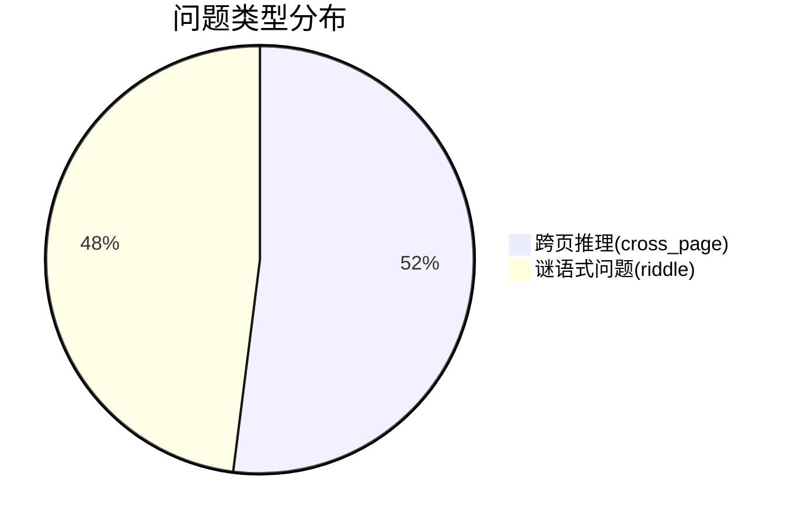
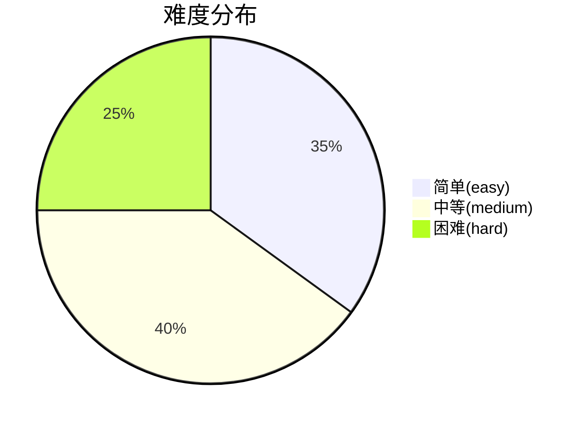

# OpenWebPuzzle

## 概述

OpenWebPuzzle 是一个模拟真实网页环境的问答数据集，包含 500 个需要综合推理能力的问答对。这些问题模拟了用户在浏览多个网页时需要连接不同信息片段来解决复杂问题的场景。

## 数据集详情

| 属性 | 值 |
|------|----|
| 样本数量 | 500 |
| 问题类型 | 跨页推理、谜语式问题 |
| 难度分布 | 简单(easy)、中等(medium)、困难(hard) |
| 生成模型 | 通义千问(qwen-turbo) |
| 数据来源 | C4数据集、中文维基百科 |
| 文件格式 | JSON Lines (.jsonl) |
| 文件大小 | 1123 KB |

## 数据结构

每个样本为 JSON 对象，包含以下字段：

```json
{
  "id": "sample_1",
  "type": "cross_page",
  "question": "基于两个文本，哪个城市既举办了2022年冬奥会又是古代丝绸之路的起点？",
  "answer": "北京",
  "difficulty": "hard",
  "context": "文本1: 2022年冬奥会在北京成功举办... [隐藏] ...丝绸之路从长安出发...",
  "source_doc": "北京是中国的首都，拥有超过2100万人口..."
}
```

### 字段说明

- **id**: 样本唯一标识符 (格式: sample_{序号})
- **type**: 问题类型
  - `cross_page`: 跨页推理问题，需要综合两个文本信息
  - `riddle`: 谜语式问题，需要识别隐藏实体
- **question**: 需要回答的问题
- **answer**: 问题的正确答案
- **difficulty**: 难度等级 (easy/medium/hard)
- **context**: 问题上下文（仅谜语式问题包含）
- **source_doc**: 源文本片段（截取前100字符）

## 数据分布

### 问题类型分布


### 难度分布


## 使用示例

### Python 加载代码

```python
import json

# 加载数据集
dataset = []
with open("webpuzzle_dataset.jsonl", "r", encoding="utf-8") as f:
    for line in f:
        dataset.append(json.loads(line))

print(f"加载 {len(dataset)} 个样本")
print(f"第一个样本: {dataset[0]['question']}")
```

### 数据集应用场景

1. **大语言模型训练**：增强模型综合推理能力
2. **问答系统评估**：测试系统处理复杂问题的能力
3. **教育技术**：构建需要高阶思维能力的练习材料
4. **信息检索研究**：测试跨文档信息整合能力

## 生成方法

数据集通过以下流程生成：

1. **数据源准备**：
   - 英文：C4数据集（Colossal Cleaned Crawl）
   - 中文：中文维基百科
   
2. **问题生成**：
   - 使用通义千问API生成跨页推理问题和谜语式问题
   - 添加网页噪声模拟真实环境

3. **难度标注**：
   - 基于规则系统自动标注难度
   - 考虑问题长度、答案长度等特征

4. **质量控制**：
   - 自动过滤无效响应
   - 限制token使用确保质量一致性

## 使用许可

本数据集采用 MIT 许可协议：

## 联系方式

如有任何问题或建议，请联系：
- GitHub：https://github.com/MengAiDev/OpenWebPuzzle

## 已知限制

1. 部分问题可能受限于源文本质量
2. 难度标注为自动生成，未经人工验证
